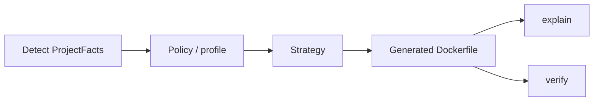

# dockly

[](https://github.com/mnafshin/dockly/actions/workflows/ci.yml)
[](https://github.com/mnafshin/dockly/releases/latest)
[](https://github.com/astral-sh/ruff)
[](./CONTRIBUTING.md#coverage-policy)
[](./docs/benchmarks.md)

**dockly** is a policy-driven Dockerfile generator (detect → policy → generate → explain → verify) with
**Java + Spring Boot** as first-party strategies. Other languages are community/later — see
[`docs/adr/0011-dockly-product-vision.md`](docs/adr/0011-dockly-product-vision.md).

Developer toolkit for **production teams** containerizing Java / Spring Boot — with optional benchmark evidence for tuning and conference demos.


## Quick start

### Python CLI (full toolkit — `.dockly.toml` SSOT)

```bash
pipx install dockly
cd /path/to/your-spring-boot-app
dockly setup --ci
```

That detects your Maven/Gradle project, writes `.dockly.toml` (`production-balanced`), generates `Dockerfile.generated`, and adds `.github/workflows/dockerfile.yml` using the [dockly GitHub Action](action/README.md).

Already onboarded? `dockly setup --ci-only`. Interactive profiles: `dockly setup --interactive`.

### Java builder plugin (Dockerfile only — POM SSOT, no Python)

```xml
<plugin>
  <groupId>io.github.mnafshin</groupId>
  <artifactId>dockly-maven-plugin</artifactId>
  <version>0.1.0-SNAPSHOT</version>
</plugin>
```

```bash
cd integrations/maven-plugin && mvn clean install   # until Maven Central (#145)
cd your-spring-boot-app
mvn dockly:generate
mvn dockly:verify
```

No `.dockly.toml` required. Optional later: `mvn dockly:export-config` to bridge to the CLI. Details: [`integrations/maven-plugin/README.md`](integrations/maven-plugin/README.md) · [ADR 0010](docs/adr/0010-pom-gradle-ssot-java-builder.md).

Team rollout for both surfaces: [`docs/adopt.md`](docs/adopt.md).

**dockly** (installable today as the `dockly` package until [#3](https://github.com/mnafshin/dockly/issues/3)) helps teams inspect a Java / Spring Boot project, commit Dockerfile strategy in config, generate and verify Dockerfiles in CI, and (optionally) run benchmark suites for evidence-backed tuning. The **Maven plugin** is a separate Java-only builder surface for teams that only need generate/verify from `pom.xml`.

See [`docs/POSITIONING.md`](docs/POSITIONING.md) for **who it is for**, core vs strategies, CI-evidenced guarantees, and how the sample projects relate to shipped behavior.

## Who it's for

Resolved in [`docs/adr/0008-target-audience.md`](docs/adr/0008-target-audience.md); product identity in [`docs/adr/0011-dockly-product-vision.md`](docs/adr/0011-dockly-product-vision.md).

| Audience | Fit |
|---|---|
| **Production teams** (primary) | Adopt via PyPI on **your** Maven/Gradle service — config-first Dockerfile workflow, explain/verify in CI, Java **17+** (undetected fallback **17**; JEP 483 AOT **24+**) |
| **Conference / storytelling** (secondary) | Clone [`java-spring-docker-sample`](https://github.com/mnafshin/java-spring-docker-sample) (or `python scripts/checkout_sample.py` from this repo) for presentations and benchmark evidence (**Java 25**) — numbers are sample-specific, not universal guarantees |
| **Personal lab only** (not primary) | Bleeding-edge sample (Boot 4 / Java 25) stress-tests the generator; you do not need to match those versions to use the CLI |

**Not** a black-box image builder like Jib or Buildpacks — you own the Dockerfile. **Not** a research-only toy — CI gates the installable CLI; benchmarks and decks are optional depth. **Not** a first-party polyglot Dockerfile toolkit in v1 — Java/Spring strategies ship here; other languages use the Strategy API ([#6](https://github.com/mnafshin/dockly/issues/6)).


## Install

**Primary path: PyPI** — install the CLI and run it on your Spring Boot project. You do not need to clone this repository for Dockerfile generation, explain, or verify.

```bash
# Recommended: isolated user install (Dockerfile workflow)
pipx install dockly
# or
uv tool install dockly

# Include benchmark run/analyze (optional; requires Docker on the host)
pipx install 'dockly[benchmark]'
# or: python3 -m pip install 'dockly[benchmark]' inside your project venv
```

See [`cli/README.md`](cli/README.md#install) for pip/editable options and upgrade commands.

### When to clone this repository

| Goal | What to do |
|---|---|
| Generate/explain/verify Dockerfiles for **your** service | Install from PyPI only |
| Reproduce benchmark evidence, presentations, or pinned CI baselines | Checkout the pinned sample (`python scripts/checkout_sample.py`) or clone [`java-spring-docker-sample`](https://github.com/mnafshin/java-spring-docker-sample) — see [`docs/presentation/README.md`](docs/presentation/README.md) |
| Contribute to the CLI | Clone; editable install — see [Contributing](#contributing) |

Resolved in [#97](https://github.com/mnafshin/dockly/issues/97) — see [`docs/adr/0006-pypi-first-distribution.md`](docs/adr/0006-pypi-first-distribution.md).

## Project naming

**dockly** is the canonical name for this project — use it when searching GitHub or PyPI, installing the package, or running the CLI ([ADR 0011](docs/adr/0011-dockly-product-vision.md)).

| Surface | Name |
|---|---|
| GitHub repository | [`mnafshin/dockly`](https://github.com/mnafshin/dockly) |
| PyPI package / `pip install` | `dockly` |
| CLI command | `dockly` |
| Config file | `.dockly.toml` (legacy `.dockly.toml` still loaded if present) |
| Env vars | `DOCKLY_*` (legacy `SPRINGDOCKER_*` still honored) |
| Maven plugin | `io.github.mnafshin:dockly-maven-plugin` / `mvn dockly:*` |
| Gradle plugin | `io.github.mnafshin.dockly` / `dockly { }` / `docklyGenerate` |

Broader springdocker compatibility/shim policy: [#9](https://github.com/mnafshin/dockly/issues/9).

The string **`java-spring-docker`** appears in the separate benchmark sample app, not in the CLI package:

| Surface | Path or coordinates | Role |
|---|---|---|
| Sample repository | [`mnafshin/java-spring-docker-sample`](https://github.com/mnafshin/java-spring-docker-sample) | Full Spring Boot app for benchmark scenarios and evidence |
| Local checkout path | `samples/java-spring-docker/` (gitignored; via `scripts/checkout_sample.py`) | Where CI and docs expect the sample after checkout |
| Sample Maven/Gradle artifact | `io.github.mnafshin:java-spring-docker` | Demo application identity inside that sample |

Those sample names predate the **dockly** product name. They do not affect installation (`pip install dockly`) or CLI usage.

## Why dockly instead of Jib or Buildpacks?

- **Jib** and **Buildpacks** optimize for build convenience and opaque image assembly.
- **dockly** optimizes for teams that want a **real Dockerfile they can own, read, and edit**.
- It combines explicit Dockerfile generation with explainability and verification workflows.
- **`explain`** is advisory static analysis for human review; **`verify`** is the pass/fail command for CI gates.

See [`docs/POSITIONING.md`](docs/POSITIONING.md) for the detailed comparison and tradeoffs.

## Architecture



Core owns detect → policy → generate → explain → verify. Strategies own language/framework optimizations. See [`docs/adr/0011-dockly-product-vision.md`](docs/adr/0011-dockly-product-vision.md) and `docs/architecture.md`.

The repo is split into these main surfaces:

- `src/dockly/` — installable CLI package and core implementation.
- `cli/README.md` — command reference and configuration details.

See [Sample project map](#sample-project-map) for which Spring Boot path to use.

## What it does

**Shipped and CI-validated:** project detection, config, Dockerfile generation, explain/verify commands, and benchmark asset/analyzer plumbing (see [`docs/POSITIONING.md`](docs/POSITIONING.md#shipped-guarantees-ci-evidenced)).

**Optional / sample-anchored:** full benchmark runs, performance comparison tables, and reference evidence from [`java-spring-docker-sample`](https://github.com/mnafshin/java-spring-docker-sample) (checked out to `samples/java-spring-docker/`).

- Detects Maven or Gradle projects.
- Writes a starter `.dockly.toml` config.
- Generates Dockerfiles with opinionated Spring Boot defaults (`jvm-balanced`: **distroless** runtime + custom **jlink** runtime + layered JAR).
- Pins generated base images by digest when known.
- Creates benchmark variants and runs benchmark suites (requires Docker and `[benchmark]` extra).
- Summarizes benchmark CSV output as a table or JSON.

Digest pins are centralized in `src/dockly/digest_pins.py` and verified in CI.
Runbook: [`docs/security.md`](docs/security.md#digest-pins) · Renovate template: [`.github/renovate.json`](.github/renovate.json)

## Sample project map

| Path | Role | Use when |
|---|---|---|
| `tests/fixtures/{maven-only,gradle-only}/` | Minimal Spring Boot apps for CLI walkthroughs and CI | Learning the CLI, Dockerfile generation, or extending tests |
| [`java-spring-docker-sample`](https://github.com/mnafshin/java-spring-docker-sample) → `samples/java-spring-docker/` | Benchmark harness + evidence (Java 25) | Reproducing scenarios / presentation numbers · [samples/README.md](samples/README.md) |

Gradle walkthroughs use `tests/fixtures/gradle-only/` with the same commands below (Maven: `tests/fixtures/maven-only/`).

See [`docs/adr/0009-external-sample-repository.md`](docs/adr/0009-external-sample-repository.md) for why the full sample lives in its own repository.

## Quick start

Install from PyPI first (see [Install](#install)). Then run against **your** Spring Boot project:

```bash
cd /path/to/your-spring-boot-app
dockly setup --ci
# optional: dockly setup --verify
# existing project: dockly setup --ci-only
# interactive profiles: dockly setup --interactive
```

Step-by-step equivalent (same result as `setup`):

```bash
dockly doctor
dockly init --build-tool maven          # if you only want a starter config
dockly configure --force                # interactive strategy
dockly dockerfile generate
dockly verify --dockerfile Dockerfile.generated --check-config-drift
```

To try the CLI without your own app, clone this repo and use the minimal fixtures (see [Sample project map](#sample-project-map)):

```bash
git clone https://github.com/mnafshin/dockly.git
cd dockly
pipx install 'dockly[benchmark]'   # or: pip install -e '.[dev]' for contributing

dockly setup --project-root tests/fixtures/maven-only
```

**Benchmark workflow** (optional; requires Docker + `[benchmark]` extra) — check out the reference sample first:

```bash
cd dockly   # repository root after clone
python scripts/checkout_sample.py
dockly benchmark generate --project-root samples/java-spring-docker --java-version 25
dockly benchmark run --project-root samples/java-spring-docker --profile quick
dockly benchmark analyze --project-root samples/java-spring-docker samples/java-spring-docker/benchmarks/01-custom-jre-jlink/results/raw.csv --format table
dockly benchmark compare --project-root samples/java-spring-docker samples/java-spring-docker/benchmarks/01-custom-jre-jlink/results/raw.csv --baseline-variant with-jlink-runtime
dockly benchmark analyze --project-root samples/java-spring-docker samples/java-spring-docker/benchmarks/03-base-image-choice/results/raw.csv --baseline samples/java-spring-docker/benchmarks/03-base-image-choice/results/baseline.json
```

**Default runtime:** `dockerfile generate` with `--recipe jvm-balanced` (the default) uses **`runtime_image = distroless`**: a digest-pinned `gcr.io/distroless/base-*:nonroot` stage plus a jlink-built JVM and layered Spring Boot JAR — not a full OS image. Distroless images have no shell, so generated Dockerfiles **omit `HEALTHCHECK`**; configure readiness probes in Kubernetes or your orchestrator. OS runtime bases are compared in benchmark scenario **03** — see [`cli/README.md`](cli/README.md#dockerfile-recipes).

## CLI workflow

1. `setup` — one-shot onboarding (detect → write `.dockly.toml` → generate Dockerfile).
2. `doctor` checks the project root and build tool.
3. `init` / `configure` write or refine config (use when you need more control than `setup`).
4. `dockerfile generate` writes a Dockerfile to the requested path (default recipe: distroless + jlink layered JAR).
5. `benchmark generate` creates benchmark scenarios.
6. `benchmark run` executes the benchmark runner.
7. `benchmark analyze` turns `raw.csv` into a table or JSON summary.

See `cli/README.md` for the command reference and config precedence rules.

## Benchmark methodology

Optional evidence subsystem — see [`docs/benchmarks.md`](docs/benchmarks.md) for the measurement model, **scenario index**, run profiles, and artifact policy.

Requires `dockly[benchmark]`. Sample scenarios live in [`java-spring-docker-sample`](https://github.com/mnafshin/java-spring-docker-sample) under `benchmarks/` (most output gitignored). Scenario 03 CI baseline: `benchmarks/03-base-image-choice/results/` in that repo (pinned via `scripts/java_spring_docker_sample.manifest.json`).

## Supported stack

| Layer | CLI / fixtures | Reference sample |
|---|---|---|
| Python | 3.10–3.12 in CI | — |
| Java | **17+** (fallback **17**; AOT **24+**) | **25** in sample config |
| Spring Boot | Projects with Boot markers | 4.0.1 sample |

Details: [`docs/jvm.md`](docs/jvm.md).

## Documentation

| Doc | For |
|---|---|
| [`cli/README.md`](cli/README.md) | Commands, config schema, recipes |
| [`integrations/maven-plugin/README.md`](integrations/maven-plugin/README.md) | Java builder plugin (POM SSOT) |
| [`integrations/gradle-plugin/README.md`](integrations/gradle-plugin/README.md) | Gradle builder plugin (build.gradle SSOT) |
| [`action/README.md`](action/README.md) | GitHub Action (Dockerfile SSOT gate) |
| [`action/README.md`](action/README.md) | GitHub Action (Dockerfile SSOT gate) |
| [`docs/adopt.md`](docs/adopt.md) | Team rollout, CI pipeline, FAQ |
| [`docs/POSITIONING.md`](docs/POSITIONING.md) | Who it's for, CI guarantees, sample vs fixtures |
| [`docs/benchmarks.md`](docs/benchmarks.md) | Scenario index & methodology |
| [`docs/jvm.md`](docs/jvm.md) | Java feature matrix |
| [`docs/security.md`](docs/security.md) | Runtime hardening & digest pins |
| [`docs/project-detection.md`](docs/project-detection.md) | Maven/Gradle / monorepo |
| [`docs/extensions.md`](docs/extensions.md) | Plugins |
| [`docs/troubleshooting.md`](docs/troubleshooting.md) | Common failures |
| [`docs/architecture.md`](docs/architecture.md) | Contributor internals |
| [`docs/adr/`](docs/adr/) | Architecture decisions |
| [`docs/presentation/README.md`](docs/presentation/README.md) | Talk decks (speakers) |
| [`docs/examples/`](docs/examples/) | Committed Dockerfile / report stubs |
| [`CONTRIBUTING.md`](CONTRIBUTING.md) | Dev setup (incl. typing) |

Experimental: [`docs/native-aot.md`](docs/native-aot.md). Sample app: [`mnafshin/java-spring-docker-sample`](https://github.com/mnafshin/java-spring-docker-sample).

## Comparison with adjacent tools

| Tool | Focus | What dockly adds |
|---|---|---|
| Jib | Dockerless image build | reviewable Dockerfile + verify |
| Buildpacks | Opinionated platform build | explicit Dockerfile + optional benchmarks |
| Manual Dockerfiles | Full control | detection, config SSOT, explain/verify |

## Contributing

Clone and editable install — see [CONTRIBUTING.md](CONTRIBUTING.md). Run `pytest` (≥80% coverage), `ruff check src tests`, and `mypy src` before pushing.
