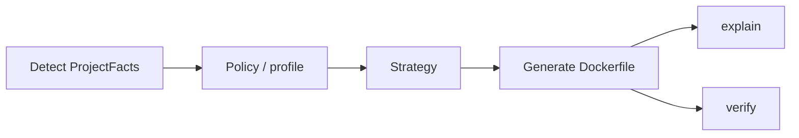

# ADR 0011: Dockly product vision (core + strategies)

## Status

Accepted (closes [#1](https://github.com/mnafshin/dockly/issues/1))

## Context

This repository is a **clean import** from [`dockly`](https://github.com/mnafshin/dockly).
The legacy project remains available for historical users; **dockly** is the forward product name and
architecture.

dockly optimized for Spring Boot Dockerfiles with a Python CLI, config-first generation, and
explain/verify workflows. That scope is valuable, but the name and architecture implied a
Spring-only product. Teams also need:

- clear separation between **project detection**, **policy/profile**, and **Dockerfile optimizations**
- a path for plain Java (non-Spring) without Boot assumptions
- an extension point for other languages later, without committing first-party maintenance of every
  ecosystem in v1

Related work tracked separately:

| Issue | Concern |
|---|---|
| [#3](https://github.com/mnafshin/dockly/issues/3) | Rebrand CLI / PyPI / config / Action / env → dockly |
| [#4](https://github.com/mnafshin/dockly/issues/4) | Rebrand Maven/Gradle builder plugins |
| [#5](https://github.com/mnafshin/dockly/issues/5) | ProjectFacts detection model |
| [#6](https://github.com/mnafshin/dockly/issues/6) | Strategy API |
| [#9](https://github.com/mnafshin/dockly/issues/9) | Optional dockly compatibility shims |
| [#10](https://github.com/mnafshin/dockly/issues/10) | Contributor guide + language strategy stubs |

## Decision

**Product name: dockly.**

dockly is a **policy-driven Dockerfile generator**: detect project facts → apply policy/profile →
generate a reviewable Dockerfile → explain → verify. Users own the Dockerfile artifact.

### Core vs strategies

| Layer | Owns | Does not own |
|---|---|---|
| **Core** | Detect → policy/profile → generate → explain → verify; config/CLI precedence; CI-friendly exits | Language-specific optimization recipes beyond what strategies provide |
| **Strategies** | Language/framework Dockerfile optimizations from `ProjectFacts` + policy | Global CLI UX, config schema ownership, verify tool orchestration |

### First-party vs community

- **First-party (maintained in this repo):** Java and Spring Boot strategies — including plain Java
  (JDK path) and Spring Boot (layered JAR when capable; Spring-aware non-layered otherwise).
- **Community / later:** Go, Python, and other language strategies via the Strategy plugin API
  ([#6](https://github.com/mnafshin/dockly/issues/6)). We publish the contract and stubs; we do **not**
  commit to shipping or supporting polyglot strategies as first-party in v1.

### Non-goals (v1)

- Maintaining first-party strategies for Go, Python, Node, or other ecosystems
- Replacing Jib, Buildpacks, or hand-written Dockerfiles for teams that prefer those models
- Becoming a black-box image builder (no committed Dockerfile)
- Guaranteeing a universal polyglot “one CLI for every stack” experience in the first release

### Relationship to dockly

- This repo is the **dockly** codebase (clean import; no AI co-author history from the legacy tree).
- `dockly` remains the legacy product/repo for users who have not migrated.
- Surface rename (package, CLI, config, Action, env) is [#3](https://github.com/mnafshin/dockly/issues/3);
  optional compatibility shims are [#9](https://github.com/mnafshin/dockly/issues/9).

## Consequences

- README and [`docs/POSITIONING.md`](../POSITIONING.md) lead with **dockly** and the core + strategy model.
- Architecture docs and the Strategy API ([#6](https://github.com/mnafshin/dockly/issues/6)) must keep
  core vs strategy boundaries explicit.
- Contributor docs ([#10](https://github.com/mnafshin/dockly/issues/10)) explain how to add a language
  strategy without forking the core.
- Existing ADRs (0001–0010) remain valid for their original decisions; when a surface still says
  `dockly` in code or docs, treat it as pre-rebrand naming until [#3](https://github.com/mnafshin/dockly/issues/3)
  lands — product identity is **dockly**.

## References

- [`docs/POSITIONING.md`](../POSITIONING.md)
- [`docs/architecture.md`](../architecture.md)
- [`docs/extensions.md`](../extensions.md) — today’s entry-point plugins; Strategy API builds on this direction
- [#1 ADR: Dockly product vision](https://github.com/mnafshin/dockly/issues/1)
- [#3 Rebrand surfaces](https://github.com/mnafshin/dockly/issues/3)
- [#6 Strategy API](https://github.com/mnafshin/dockly/issues/6)
