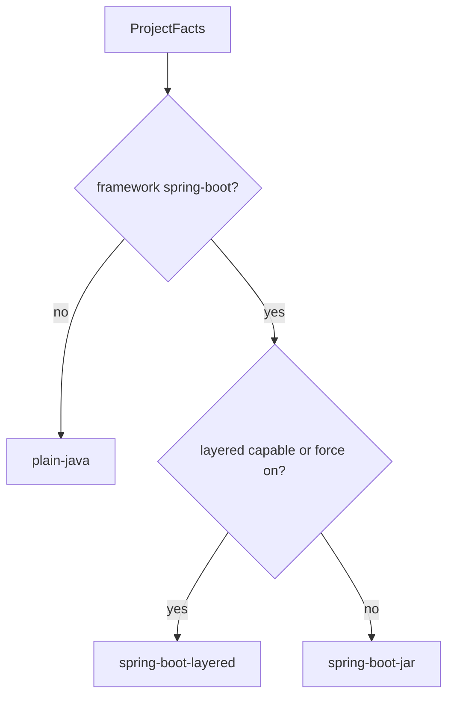

# Capability gating matrix

How dockly chooses Dockerfile paths from **ProjectFacts** + **Policy**
([#7](https://github.com/mnafshin/dockly/issues/7)). Strategies: [`strategies.md`](strategies.md).

## Paths

| # | Condition | Strategy ID | Dockerfile behavior |
|---|---|---|---|
| 1 | Spring Boot + layered capable (default) | `spring-boot-layered` | Spring Boot **layertools** extract + layered `COPY` |
| 2 | Spring Boot + layered forced off / not capable | `spring-boot-jar` | Spring-aware **executable JAR** + Java optimizations (no layertools) |
| 3 | Plain Java (`framework=plain-java`) | `plain-java` | JDK path only (jlink / multi-stage / AppCDS per policy) — **no** Boot assumptions |



## Force layered on/off

| Surface | How |
|---|---|
| CLI | `dockly dockerfile generate --use-layered-jar` / `--no-use-layered-jar` |
| Config | `[dockerfile] use_layered_jar = true\|false` in `.dockly.toml` |
| Policy API | `Policy(force_layered_jar=True\|False)` |

Plain Java **always** takes path 3 (layered flags are ignored for layertools).

## Explain

`dockly explain` reports a `capability_path` object: selected strategy id, rationale, and whether the Dockerfile text contains layered-JAR markers.

```bash
dockly explain Dockerfile.generated --format json
# → capability_path.strategy_id / rationale / dockerfile_has_layered_jar
```
